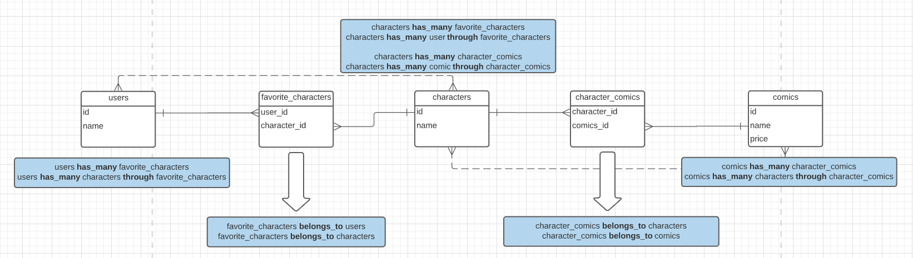
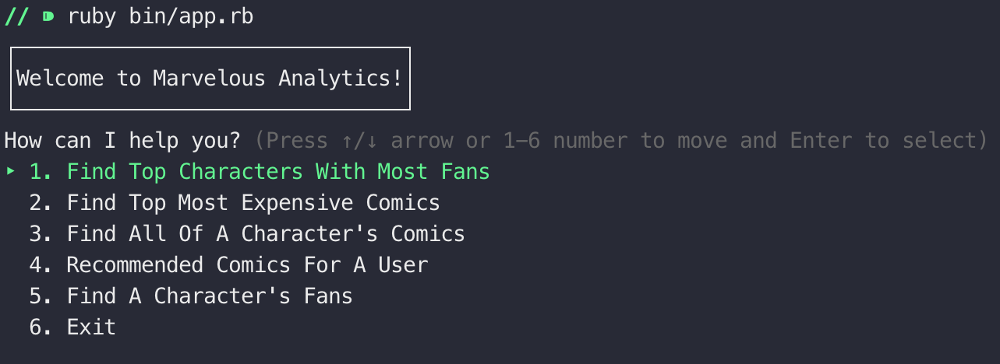
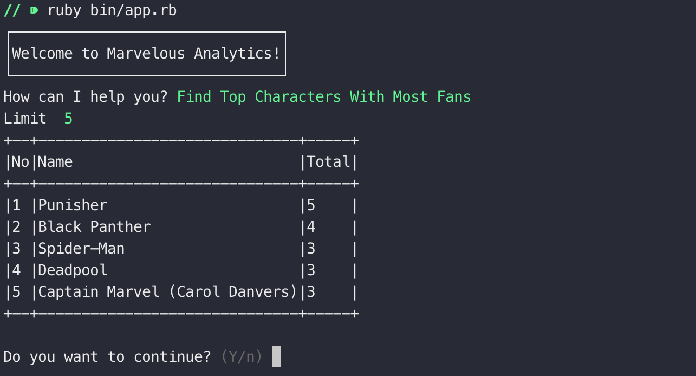

# Marverlous Analytics

Simple analytics CLI using ruby active record and Marvel API (https://developer.marvel.com/) for Flatiron Phase #1 project in order to understand about class relationship and Active Record.

## Installation
Run this command in the terminal
```
bundle install
```
Type this command to start the application
```
ruby bin/app.rb
```

## Class Relationship


## Application Screenshots


